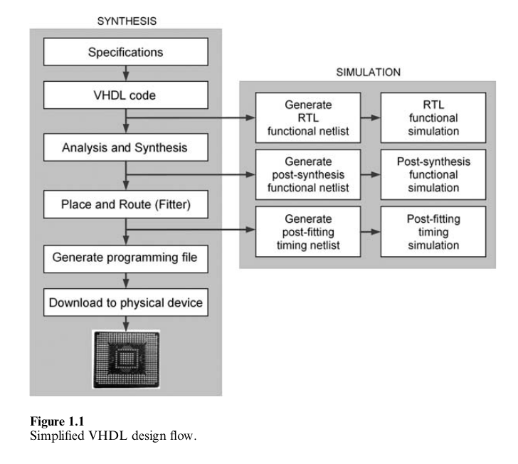
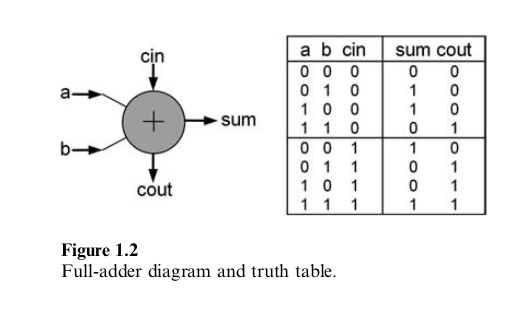
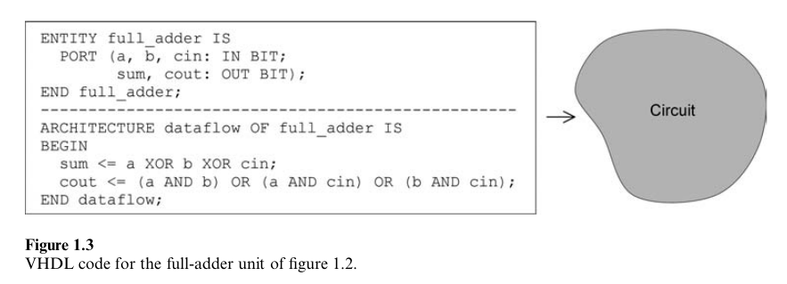
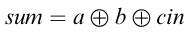
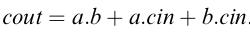
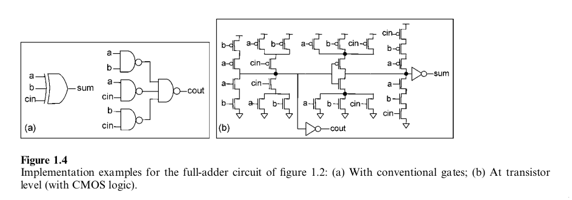
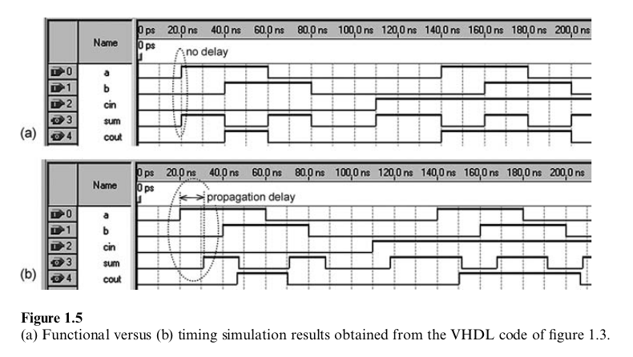

1 Introduction
^^^^^^^^^^^^^^^^^^^^^^^

1.1 关于VHDL
====================

本章主要描述VHDL是什么以及VHDL可以做什么。同时会列出流行的合成与模拟工具，并总结典型的设计流程。

VHDL是一门硬件描述语言。代码描述了电子电路的行为或结构，由此编译器可以推导出符合标准的物理电路。其主要应用包括CPLD/FPGA（Complex Programmable Logic Device/Field Programmable Gate Array）芯片上的数字电路合成以及ASIC（ApplicationSpecific Interated Circuit）生产的布局与掩码生成。

VHDL代表VHSIC（Very High Speed Integrated Circuits)硬件描述语言，最初来自于1980年代美国国防部资助项目。其最初版本为VHDL 87，后来更新为VHDL 93，然后是VHDL 2002，最后为VHDL 2008。它是由IEEE通过1076至1164标准所标准化的第一个硬件描述语言。VHDL是技术/厂商无关的，所以VHDL代码是可移植与可重用的。

VHDL支持合成与电路模拟（两者都会在本书中探讨）。前者是源代码到实现所需功能的硬件结构的转换，而后者是确保这些功能确实为合成电路所实现的测试过程。在所有章节中，我们将会关注于可合成的VHDL结构，而第10章则会关注于VHDL模拟。

1.2 VHDL版本
=================

VHDL第一版发布于1987年，通过IEEE 1076-1987标准VHDL语言参考手册进行描述。其后发布多个版本。

* IEEE 1076-2000标准VHDL语言参考手册
* IEEE 1076-2002标准VHDL语言参考手册
* IEEE 1076-2008标准VHDL语言参考手册

其它相关文档，主要是合成包，列于下面。

* IEEE 1164-1993 VHDL模型交互的标准多值逻辑系统
* IEEE 1076.3-1997 标准VHDL合成包
* IEEE 1076.5 VHDL寄存器传输层（RTL）合成标准

由于2000文档很快为2002版本所代替，因而通常认为存在四个VHDL版本：VHDL87，VHDL93，VHDL2002与VHDL2008。

VHDL2008中引入的扩展将会在对应的章节中进行介绍。包相关的额外功能也会在附录H-N中对应的数据包中提及。

1.3 设计流程
=================

设计流程的简化图如图1.1所示。我们假定设计者已经拥有了标签电路应生成的规范集合。第一步是编写完全满足这些规范的VHDL代码。这些代码必须被保存到以.vhd为扩展名的文本文件中，并且与其主实体名字相同。接下来，代码会使用合成工具进行编译。在编译过程中会生成多个文件。合成器会将代码分割为选定的设备中可用的代码结构，从而在安装（place and route）时编译所推导的每个结构会被会安置到设备中特定的位置处。位置很重要，因为它会极大地影响结果电路的时间行为。使用安装过程所生成的时间信息，软件支持电路进行完全模拟。一旦满足规范，设计可以进入最后步骤（实现），在此过程中，会生成设备（当使用CPLD或FPGA）或掩码（ASIC）的编程文件。在CPLD/FPGA的情况下，将可编程文件由计算机下载到目标设备来完成设计。

1.4 EDA工具
================

有多个EDA（Electronic Design Automation）工具可用于使用VHDL的电路合成与仿真。有些工具是由CPLD/FPGA公司（Altera，Xilinx，等）提供，而另一些工具则由第三方软件公司（Mentor Graphics，Synopsys，Cadence，等）提供。一些工具列于下方。

* 来自Altera：Quartus II（用于合成与图形化模拟）
* 来自Xilinx：ISE（XST用于合成，ISE模拟器用于模拟）
* 来自Mentor Graphics：Precision RTL与Leonardo Spectrum（合成），ModelSim（模拟）
* 来自Synopsys/Synplicity：Design Compiler Ultra与Synplify Pro/Premier（合成），VCS（模拟）
* 来自Cadence：NC-Sim（模拟）
* 来自Aldec：Active-HDL（模拟）

本书中的设计使用Altera的Quartus II Web Edition 8.1或新版本进行编译与模拟，部分使用Xilinx的ISE WebPack 10.1或新版本进行编译与模拟。在第10章的模拟中，同时使用了ModelSim 6.3g。

在教程中对下面的EDA进行了描述：

* Quartus II 9.0 sp1 Web Edition（附录B）
* ISE 11.1 WebPack（附录C）
* ModelSim 6.3g Web Edition（附录D）

1.5 VHDL代码到电路的转换
=============================

一个完全加法器单元如图1.2所示。其中，a与b表示要进行相加的输入位，cin是进位，sum是和，而cout是进位输出。如真值表所示，当高电平的输入个数为奇数个时，sum必定为高电平，而当两个或多个输入为高电平时，cout必定为高电平。

图1.2的full-adder的VHDL代码如图1.3所示。正如所看到的，它由一个ENTITY，其中包含电路端口（管脚）描述，以及一个ARCHITECTURE，其中描述电路如何作用，组成。我们可以在后者中看到输出是通过

与

进行计算的。

注意：除了STD_ULOGIC符号（'Z','X',等），VHDL并不是大小写敏感的。为了使得代码更易于阅读，在本书中会使用大写字母表示保留字，而对用户可以选择的单词则使用小写字母。

由图1.3左侧的VHDL代码可以看出，会推导出物理电路。然而，有多种实现上述所描述的等式的方法，所以实际的电路会依赖于目标技术以及编译步骤。为了演示这种可能性，图1.4中展示了两个示例。在(a)中，sum与cout是使用传统门电路来计算的（这是当目标为CPLD与FPGA的情况），而在(b)中，为晶体管级实现，使用了CMOS逻辑（用于ASIC）。而且，可以设置合成工具为区域或速度来优化布局，这也会影响最终的电路。

1.6 电路模拟
=================

当由代码推导出最终的电路后，其操作应总是通过依然处于设计阶段（合成之后）的模拟方法进行验证，如图1.1所示。当然，物理系统最终也应进行验证。然而，相对于其它的电路设计类型，VHDL设计，一旦通过细心的EDA模拟，基本上保证也可以通过物理测试。

使用VHDL的测试将会在第10章中进行探讨。为了概要介绍，让我们考虑带有图形化输入的模拟（直接在Quartus II或ISE工具中完成）。在此情况下，模拟器将会显示与图1.5中类似的波形。确实，图1.5包含了使用图1.3的代码合成的电路的模拟结果，其中实现了图1.2中的full-adder单元。在图1.5a中，展示了功能模拟（电路中的传播时延被忽视），而图1.5b展示了时间模拟（考虑到传播时延）。本书中几乎所有的模拟都是后一类别。

输入端口与输出端口在图1.3的ENTITY中列出。我们可以为输入信号（在此情况下为a，b与cin）自由选择值（波形），而模拟器将会计算并绘制输出信号（sum与cout）。正如图1.5中所看到的，输出确实完成所期望的功能。

1.7 VHDL语法
=================

在VHDL描述中，需要小心对待其语法。为了使其更易于理解，在IEEE 1076-2008标准VHDL语言参考手册中进行了一些简化，使其近似于EBNF（Extended Backus-Naur Form）风格。所进行的简化并未影响信息的质量；确实，必要时包含额外的注释与示例能尽可能简化语法，总是强调可合成的内容。

1.8 VHDL中的数字与字符
===========================

整型
:::::::::::::::::

整型通常表示为10进制数字。在VHDL中其默认范围为-(2^31-1)至+(2^31-1)。下划线（_）可用于数字中的任意位置以帮助显示，而对合成值没有影响。幂值也可以接受。尽管并不常见，由2至16的其它进制也可以应用，在此情况下，进制值必须位于数字之前，而数字必须以符号#进行包围。如下所示。

* 10进制：5,32,3250,3_250,3E2(=3*10^2=300)
* 其它进制（由2至16）：
  2#0111#（整型7,由于0*2^3+1*2^2+1*2^1+1*2^0=7）
  5#320#（3*5^2+2*5^1+0*5^0=85)
  16#9F#（9*16^1+5*16^0=159)
  3#201#E4（(2*3^2+0*3^1+1*3^0)*3^4=1539）

二进制值
::::::::::::::::::::

二进制值使用单引号（单个位）或双引号（多个位）包围。除了通常的二进制表示之外，多位值也可以表示为八进制或十六进制形式。在此情况下，'O'（八进制）或'X'（十六进制）必须位于位向量之前。对于二进制，也可以使用可选的'B'。由于VHDL并不是大小写敏感的，小写字母也同样适用。如下所示的示例，在括号中包含等同的十进制值。

* 通常二进制形式
  '0'(=0), "0111"(=7),b"0111"(=7),B"11110000"(=240)
* 八进制与十六进制形式
  O"54"(5*8^1+4*8^0=44),o"0"(0*8^0=0),X"C2F"(12*16^2+2*16^1+15*16^0=3119),x"D"(13*16^0=13)

无符号值
:::::::::::::::::

在无符号系统中，所有数值为非负的，所以范围为0至2^N-1，其中N是位数。例如，对于8位，值为0（"00000000"）至255（"11111111"）。

有符号值
::::::::::::::::

与之相对，在有符号系统中，数字可以是负数。对于N位，整数范围为-2^(N-1)至2^(N-1)。负数的通常表示是2的补。如果MSB（最重要位，通常为最左位）为0，则数字为正数；如果为1，则为负数。为得到这样的表示，我们由正值开始，反转所有位，然后将结果加1。如下面的示例所示。

"0111"=+7
"1001"=-7(+7的补为"1000"，加1，得到"1001")
"010000"=+16
"110000"=-16(+16的补为"101111"，加1，得到"110000")

字符
:::::::::::

扩展ASCII表（附录H）中的字符是可合成的。遵循位与位向量相同的格式，单个字符以一对单引号包围，而字符串（也是可合成的）以一对双引号包围。如下面的示例所示。

'A', 'a', '$', "VHDL", "mp3"

