2 Code Structure
^^^^^^^^^^^^^^^^^^^

2.1 基础VHDL单元
=====================

本章描述构成VHDL代码的基础部分：库声明，ENTITY与ARCHITECTURE。同时包含一些介绍性设计示例。

正如图2.1中所展示的，一个基础VHDL代码由三部分组成：

* 库/包声明：包含设计中需要的所有库列表与相应的包。最常用的库有ieee，std与work（后两者是默认可见的）。
* ENTITY：主要指定电路的I/O端口，以及（可选的）常用变量。
* ARCHITECTURE：包含VHDL代码，描述电路如何作用，由此可以推导符合标准的硬件。

LIBRARY是常用到的代码片段集合。将其放置在库中可以允许代码代码并与其它设计共享。一个库的典型结构如图2.1b所示。所有之前设计的电路都可以是库的组成部分。然后这样的电路可以使用COMPONENT关键字用于其它设计中。另一种流行的选择是以FUNCTION或PROCEDURE（被称为子程序）的形式编写常用的代码片段，然后将其放置在PACKAGE中，其位于库中。数据类型的通用声明通常也位于库中。

.. image:: _static/figure-2.1.png

2.2 VHDL库与包
======================

标准VHDL库为std与ieee，而其主要包列于下表。同时列出了常用的非标准包。

std库
:::::::::::::

* standard包（附录H）：此包定义于IEEE1076标准之中，自VHDL第一版开始就是其组成部分。其中包含多个数据类型定义（BIT，INTEGER，BOOLEAN，CHARACTER，等）以及相应的逻辑，算术，比较，移位，与连接操作符。此包在VHDL2008中进行了扩展。
* textio包（附录M）：用于文本与文件的资源包，同样定义于IEEE1076标准之中，同样在VHDL2008中进行了扩展。

ieee库
::::::::::::

* std_logic_1164包（附录I）：定义9值数据类型STD_ULOGIC与STD_LOGIC，相对于原始的BIT类型，其主要特性在于额外的可合成值，不在乎（'-'）与高阻抗（'Z'）（BIT仅允许0和1）的存在。此包定义于IEEE1164标准之中。
* numeric_std包（附录J）：引入了类型SIGNED与UNSIGNED以及相应的操作符，使用STD_LOGIC作为基础类型。此包定义于IEEE1076.3标准之中。
* numeric_bit包：与numeric_std相同，但使用BIT作为基础类型。
* numeric_std_unsigned包（附录N）： 在VHDL2008中引入，此包被期望用于替换非标准包std_logic_unsigned。
* numeric_bit_unsigned包：同样在VHDL2008中引入，此包类似于上面的包，但是操作BIT_VECTOR类型而不是STD_LOGIC_VECTOR。
* env包：在VHDL2008中引入，它包含用于与模拟环境通信的stop与finish过程。
* fixed_pkg包（以及相应的包）：Kodak开发，VHDL2008中引入，它定义了无符号与有符号的定点类型UFIXED与SFIXED以及相关的操作符。
* float_pkg包（以及相应的包）：同样由Kodak开发，并在VHDL2008中引入，它定义了浮点类型FLOAT以及相关的操作符。

非标准包
::::::::::::::

* std_logic_arith包（附录K）：定义了类型SIGNED与UNSIGNED以及相对应的操作符。此包部分等同于numeric_std。
* std_logic_unsigned包：引入了将STD_LOGIC_VECTOR信号类型作为无符号数字进行算术，比较以及其移位操作的函数。
* std_logic_signed包（附录I）：与上面的包相同，但是处理有符号数字。

最后两个包可以看作是对std_logic_1164包的补充，因为后者并不包含对STD_LOGIC_VECTOR类型进行算术或比较操作符，而前两者有。

当处理数据类型与操作符时，所列的包将会分别在第3章与第4章中进行详细探讨。

2.3 库/包声明
=====================

为使包对设计可见，需要两个声明，一个用于包所在的library，另一个是指向特定包的use语句。对应的语法如下所示。

.. image:: _static/2-1.png

最常用的包有：

* std库中的standard包（默认可见）
* work库（保存工程文件所在的目录，同样默认可见）
* ieee库中std_logic_1164包（当需要时，必需显示式声明）

对应的语法声明如下。

.. code::

    1 ------------------------------------------------
    2 LIBRARY std;            --optional declaration
    3 USE std.standard.all;   --optional declaration
    4 LIBRARY work;           --optional declaration
    5 USE work.all;           --optional declaration
    6 LIBRARY ieee;
    7 USE ieee.std_logic_1164.all;
    8 USE work.my_package.all
    9 ------------------------------------------------

standard包默认可见，因而无需要显示式声明。对于work库同样如此。与之相对，当在工程中使用STD_(U)LOGIC类型时需要声明std_logic_1164包。如果同时需要用户编写的额外包，则也必需要进行声明，如上面的第8行所示。

注意上面声明中的分号标识声明或语句的结束，而双横线表示注释。VHDL代码并不是大小写敏感的。正如所提到的，关于库/包的其它细节将会在下面的两章中详细讨论。

2.4 ENTITY
==============

ENTITY的主要组成部分是PORT，它是电路所有输入与输出端口的规格列表。简化的语法如下所示。

.. image:: _static/2-2.png

实体名字可以是任意单词，除了VHDL保留字（附录G）。对于端口名字同样如此。

上述语法中PORT域的所有成员均是信号（相对于变量）；也就是，电路的输入与输出线。其模式可以是IN，OUT，INOUT或BUFFER。如图2.2a所示，IN与OUT是真正的单向线路，而INOUT是双向线路，当一个信号被发出同时会被内部所用（读取）时使用BUFFER。最后类型可以是BIT，INTEGER，STD_LOGIC等。

通过创建一个内部的辅助信号，可以避免BUFFER的使用。而且，当使用VHDL 2008实现时，模式OUT可用于内部读取。

.. image:: _static/figure-2.2.png

当实现记忆存储时，INOUT的使用特别重要，通常会使用相同的数据总线用于写入与读取。

示例：下面是图2.2b的NAND门的ENTITY，命名为nand_gate。其含义如下：电路有三个I/O端口，其中两个输入（a与b，模式IN），而另一个为输出（x，模式OUT）。所有三个信号的类型为BIT。

.. image:: _static/2-3.png

在前面的语法中，只显示了PORT域。然而，正如下面所示，一个实体可以包含三个其它域，GENERIC声明部分（在PORT之前），一个通用描述部分（在PORT之后），以及最后是一个带有被动调用或处理（也在PORT之后）的部分。

.. image:: _static/2-4.png

只有实体的PORT部分是必须的。可选的GENERIC部分用于声明为设计，包括端口，全局可见的常量。

可选的描述部分（在PORT之后），尽管很少使用，可以包含下述内容：子程序声明，子程序体，类型声明，子类型声明，常量声明，信号声明，共享变量声明，文件声明，别名声明，属性声明，属性规格，断联规格，使用子句，组合模板声明，以及组合声明。

最后，可选的语句部分，同样很少使用，可以包含被动调用与/或被动处理（也就是，并不涉及任何信号赋值的部分。例如，它们可以用于测试PORT值）。GENERIC域会被经常用到，而另两个可选部分很少使用。

示例：下面的ENTITY包含上面提及的四部分中的前三个。

.. image:: _static/2-5.png

在VHDL 2008中，实体的描述部分也可以包含下列内容：子程序实例化声明，包声明，包体，包实例化声明，以及PSL声明。参看2.9节了解其它特性。

2.5 ARCHITECTURE
====================

ARCHITECTURE包含电路如何作用的描述，由此可以推导实际的电路。简化的语法如下所示：

.. image:: _static/2-6.png

可见，实体包含两部分：描述（可选）部分，以及语句（代码）部分。前者包含也实体描述部分相同的内容，以及组件声明与配置规格（在VHDL 2002或VHDL 2008中）。后者是VHDL语句所在的位置。与实体类似，结构名可以是任意的单词，包括与实体名相同的名字。

示例：如下是图2.2b中NAND门的ARCHITECTURE，以arch命名。其含义如下：电路必须执行a与b之间的NAND操作，将结果赋值给x。在此示例中，在描述部分并没有声明，而代码仅包含一条逻辑语句。

.. image:: _static/2-7.png

2.6 GENERIC
==================

GENERIC声明允许通用参数的规格（也就是，通用参数可以很容易为不同的应用而修改）。其目的是参数化设计，使得代码更为灵活与可重用。

正如2.4中ENTITY的语法所示，GENERIC是PORT子句前允许的唯一声明，从而使得这些常量为全局可见，因为它们甚至可以用于PORT规格之中。GENERIC声明的简化语法如下所示。

.. image:: _static/2-8.png

示例：下面实体中的GENERIC声明指定了两个参数，名为m与n。第一个为INTEGER类型，值为8,而第二个为BIT_VECTOR类型，值为"0101"。因而，当代码中遇到m与n时，值8与"0101"会自动赋值给它们。

.. image:: _static/figure-2.3.png

.. image:: _static/2-9.png

GENERIC MAP：如果包含一个GENERIC声明的COMPONENT（类似上面的代码）在其它设计中被实例化，出现在被实例化的组件中的通用常量值可以为主设计所覆盖。这是通过GENERIC MAP声明实现的，我们会在第8章研究组件实例化时遇到此声明。GENERIC使用的示例演示会在下一节（示例2.4）中展示。

在VHDL 2008中，除了传统的通用常量，通用类型与通用子程序也被支持。通用常量可用于相同通用列表的其它通用常量的声明中。通用声明所在的位置也进行了扩展，除了ENTITY与BLOCK头部以外，也可以在PACKAGE（第8章）与子程序头部（第9章）中声明。

2.7 初步VHDL示例
========================

在本节中，我们会展示一些VHDL代码的入门级示例。尽管我们还没有探讨示例中出现的结构，他们有助于展示基础内容，而忽略整体代码结构。每个示例通过解释性注释与仿真结构来实现。

示例2.1：Compare-Add电路
::::::::::::::::::::::::::::::

在图2.3的左侧，展示了一个两时钟电路。输入是两个无符号的3位值（a与b，范围由0至7），而输出为comp（单一位）与sum（为避免溢出，需要4位，所以范围为0至15）。上半部分比较a与b，当a>b时生成'1'，否则生成'0'。下半部分将a与b相加，生成sum。

此电路的VHDL代码如下所示。注意短横线的使用（1,4,10,16行）可以更好地组织代码（将其分为三个基础部分）。库声明出现在第2-3行。名为comp_add的实体出现在第5-9行。最后名为circuit的结构出现在第11-15行。

.. image:: _static/2-10.png

注意， 此实体包含所有I/O端口。输入为a与b（模式IN，第6行），两者类型为INTEGER，范围为0至7（3位无符号值）。输出为comp（第7行）与sum（第8行），前者为STD_LOGIC（单个位）类型，后者为INTEGER类型，范围为0至15（4位无符号值）。

结构仅包含两条语句，第一条语句（13行）进行比较（通过WHEN语句），而第二条语句（14行）计算和（通过+操作符）。在此示例中，在结构的描述部分并没有任何声明。

仿真结果如图2.3所示。注意，所有的输入信号以带有"I"的箭头为前缀，而每个输出信号显示为带有"O"的箭头。固定值（5）被赋值给a，而b在整个3位范围（0至7）上变化。当a>b时，结果为comp='1'，而sum=a+b（无溢出）。可以看到这是一个时间仿真，因为考虑到了内部传播时延。

注意，当b由3变化到4时，在comp上出现脉冲干扰。这是因为在此变化时，b的所有位发生变化（"011"->"100"），因而所有位并不会在精确的时刻同时发生变化，而且实际上的晶体管并不是即时的，因而这种扰动是十分常见的。

.. image:: _static/figure-2.4.png

示例2.2：D-type Flip-Flop(DFF)
::::::::::::::::::::::::::::::::::::::

图2.4展示了一个DFF，这是最基础的存储电路之一。它的输入为d（data），clk（clock）与rst（reset），而q（存储的数据）是其输出。在此情况下，DFF在正时钟变换（向上）时触发，但相反的触发时刻也是可能的。当clk由0变换到1的时刻，输出拷贝输入(q<=d)，直到出现新的向上的时钟边界。重置是异步的（也就是它并不依赖于clk），因而如果发生rst='1'时，输出立即被清零。

有多种实现DFF的方式，其中一种就是下面所展示的方案。然而，必须记住的是，VHDL代码本质上是并行的（相对于序列化的常规计算机程序），因而要实现任意的时钟电路，我们必须强制VHDL变为序列化，这也可以通过PROCESS来实现，如下所示。

.. image:: _static/2-11.png

关于代码的解释如下。

第2-3行：代码的第一部分（库声明）。回忆一下，此声明类型由库名字后跟库use子句组成。因为在此设计中使用了数据类型STD_LOGIC，因而必须包含包std_logic_1164。另外两个库（std与work）默认可见。
第5-8行：代码的第二部分（ENTITY），在此示例中名为flip-flop。
第10-20行：代码的第三部分（ARCHITECTURE），此处与实体同名。
第6行：输入端口，所有输入端口为STD_LOGIC类型。
第7行：输出端口，所有输出端口为STD_LOGIC类型。
第12-19行：结构的代码部分（由单词BEGIN开始）。在此示例中，代码仅包含一个必需的PROCESS，因为我们要实现一个顺序电路（位于过程中的代码被顺序执行）。
第12行：注意，在此过程的感知列表中包含两个信号（clk，rst）（此过程会在任何一个信号发生变化时运行）。
第14-15行：如果rst变为'1'，无视clk，flip-flop会被重置。
第16-17行：如果rst未被激活，而clk发生变化（一个EVENT发生在clk上），而这样的事件是一个上升边界（clk='1'），则输入信号（d）会被存储到flip-flop中（q<=d）。
第15与17行：操作符'<='用于将一个值赋给一个SIGNAL（所有端口默认为信号）。相对应地，':='用于VARIABLE。
第1,4,9与21行：用于更好地组织代码。

此代码的仿真结果显示在图2.4中（注意，这也是一个时间模拟）。读者被邀请进行检测来确认DFF功能。时钟波形中所包含的箭头用于强调显示电路处于“透明”的点（也就是，输出拷贝输入的时刻）。同时可以注意到rst确实是异步的。

示例2.3：注册Comp-Add电路
::::::::::::::::::::::::::::::::::::

图2.5显示了一个组合前两个示例的电话；DFF被添加到comp_add电路的输出以“注册”（存储）comp与sum（分别被称为reg_comp与reg_sum）。

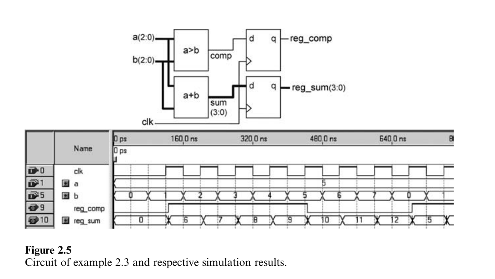

电路的VHDL代码如下所示。原始信号（comp，sum）是在结构的初始化部分（第16-17行）进行计算的。然后是过程（第18-24行），用于flip-flop推理（顺序电路）。注意，总共需要五个DFF。同时可以注意到，因为此时comp与sum是内部信号，它们是在结构的声明部分进行指定的（第13-14行）。

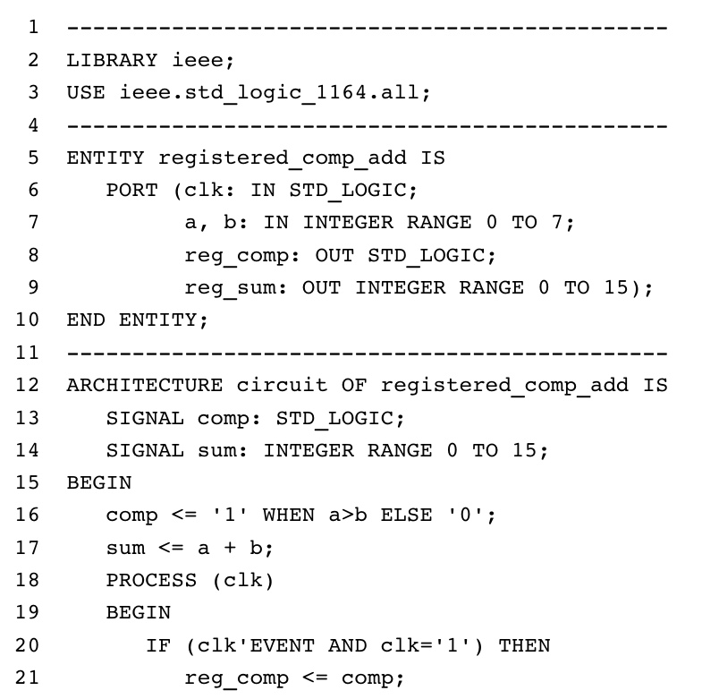

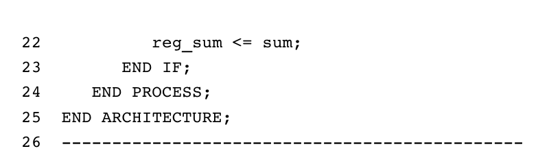

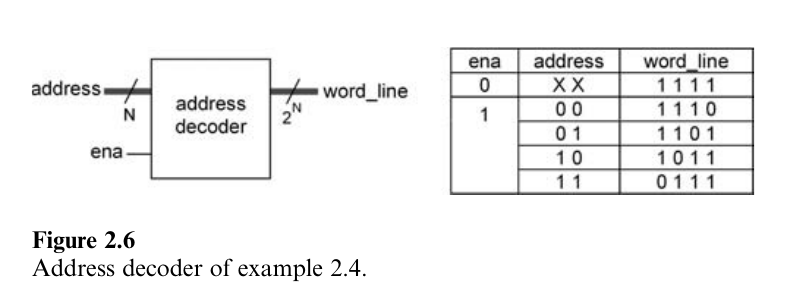

仿真结果如图2.5所示。现在来观察一下，相对于示例2.1,输出仅在正时钟边界出现时进行更新。

示例2.4：通用地址解码器
::::::::::::::::::::::::::::::::::::::

图2.6显示了一个通用N位地址解码器的顶层图示。电路有两个输入，分别被称为address（N位）与ena（一位）以及名为word_line的输出（2^N位）。正如真值表所示，输出仅有一位不同于所有其他位，其位置由输入值确定。注意，当ena='0'时，所有输出位必须为高电平。

电路的VHDL代码如下所示。此代码不需要库声明，因为在此示例中仅使用了standard包（默认可见）中的数据类型。ENTITY位于第2-7行，包含GENERIC与PORT声明。N作为一个通用参数（第3行）输入，从而代码可以很容易修改来适用于任意地址解码器大小。输入与输出信号（第4-6行的PORT声明）如图2.6所示。

ARCHITECTURE位于第9-16行。它是完全通用的，因为当电路的尺寸（N）被修改时，无需任何变化（唯一的修改位于第3行）。GENERATE语句用来创建循环，从而使得当ena='0'时，所有输出位为'1'，或是当ena='1'时，仅生成一位等于'0'（其地址由address表示的值来确定）。

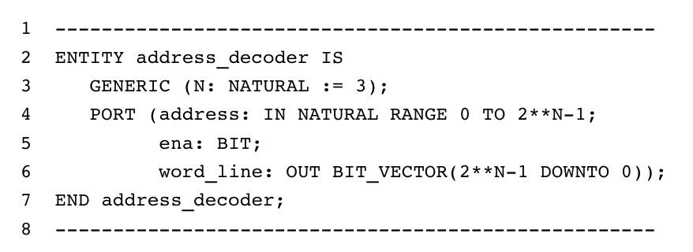

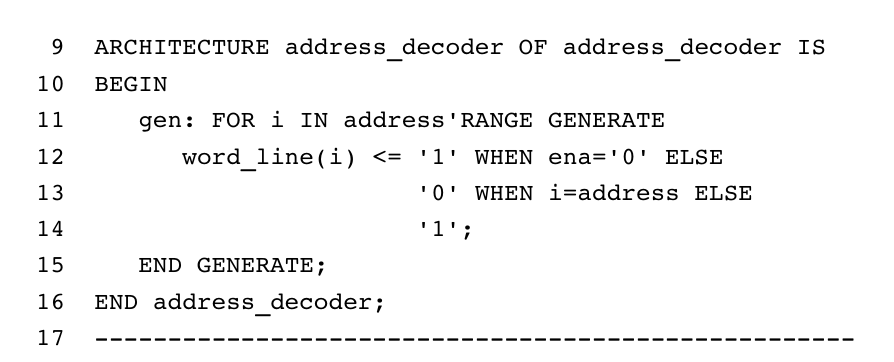

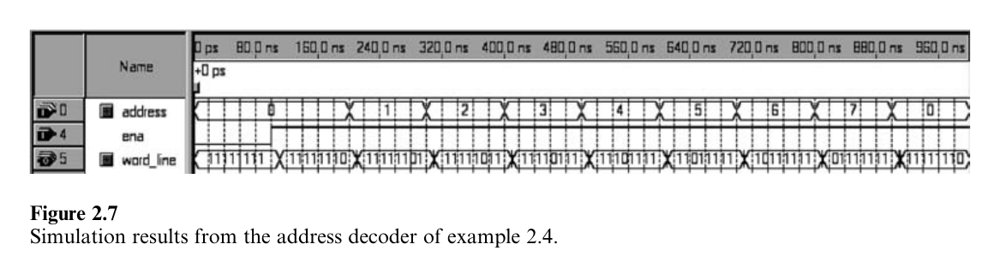

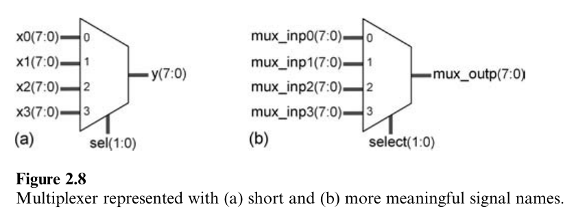

当N=3时，仿真结果如图2.7所示。正如所看到的，当ena='0'时，所有输出为高电平。在ena被打开后，一个输出位变为低电平，其位置由address确定。

2.8 编码指导
==================

为了节省书籍空间，在可能的情况下，VHDL代码通常使用短信号名表示（从而语句可以适应一行），而多个信号说明位于相同行。另外，为了演示不同数据类型的用法，在示例中使用了多种数据类型。然而，当为大型项目编写VHDL代码时，特别是当涉及多个设计团队时，尽可能标准化代码风格（特别是接口信号）并使用更有意义的信号名是非常重要的。以图2.8为例，节省空间的代码如下所示（图2.8a）：

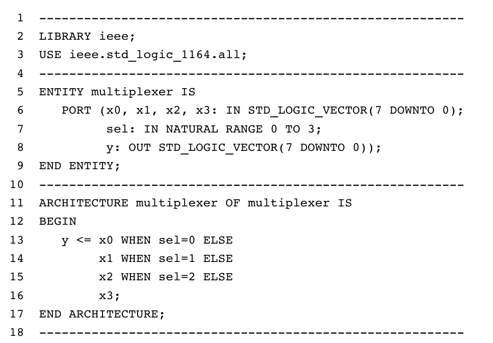

与之相对，更为扩展的代码如下所示（图2.8b）：

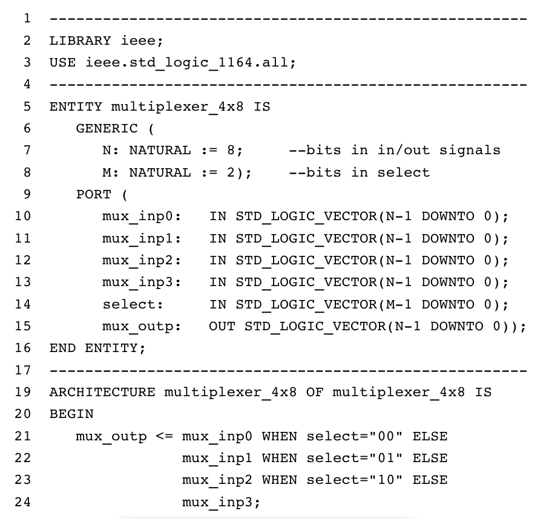

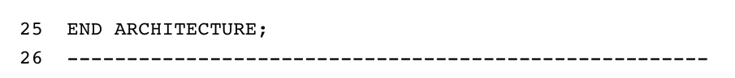

观察上面的代码：

1）使用了更有意义（通常更长）的信号名（第5行与第10-15行）。
2）实体中的每个信号在单独行中指定（第6-15行）。
3）经常出现并使得代码更为通用的值（也就是适用于其他总线尺寸）使用GENERIC进行声明（第7-8行）。
4）在所有端口中（in/out信号，第10-15行）中使用STD_LOGIC(_VECTOR)，这是多团队设计中的通常接口（工业标准）。
5）仅使用降序索引来指定数据范围，而最末位值总为0（小端，第10-15行）。因而MSB总是位于左侧，并具有最高索引值，也就是总为“位数-1”。
6）保留字使用大写字母输入，而（用户选择）其他单词使用小写。这有助于理解与调试代码（注意VHDL并不是大小写敏感的）。另一个选择是为保留字使用粗体。
7）三个基本代码块（库声明，实体与结构）之间的分隔线（第1,4,17,26行）有助于组织代码。在结构中使用其他（但是较短）的分隔线也同样很有益处（其他人也许喜欢空行）。可选标签（例如用于PROCESS的标签）同样也有帮助。

其他有用的实践包括：

8）为工程，主文件与主实体使用相同的名字。
9）避免使用BUFFER模式。如果要使用，使用辅助信号，在结构的声明部分指定。
10）避免在相同的代码中使用多个ENTITY-ARCHITECTURE对，这样使用CONFIGURATION或是部分代码被注释。
11）为得到正确结果，当设计有限状态机（FSMs）时要严格。小心其潜在的问题。
12）最后，尝试练习下面的问题：
-我正在设计的电路是组合还是顺序？
-如果是组合，它是逻辑组合还是算术组合？
-如果是顺序，它是一个普通设计还是基于FSM的设计？
-如果顺序，我应该期待编译器推导多少flip-flops？（记住，这总是被精确确定的。）

2.9 VHDL 2008
====================

考虑到本章所涉及的内容，VHDL 2008中主要添加的内容如下。VHDL 2008是向后兼容VHDL 2002的。

1）包standard，textio，std_logic_1164与numeric_std进行了扩展。
2）新添加了包numeric_std_unsigned，numeric_bit_unsigned，env，fixed_pkg与float_pkg。
3）可以包含在ENTITY或ARCHITECTURE声明部分的元素列表进行了扩展，同时允许如下元素：子程序实例化声明，包声明，包体，包实例化声明以及PSL声明。
4）GENERIC声明选项也进行了扩展。除了传统的通用常量，未指定的通用类型与通用子程序也可以被声明，如下面简化的语法所示。

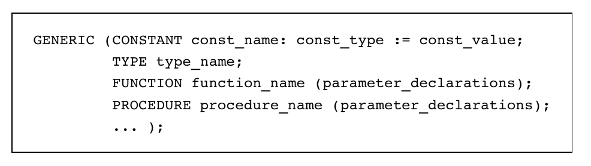

5）而且，通用常量可以用于相同通用列表中的其他通用常量指定中，如下面的示例所示。

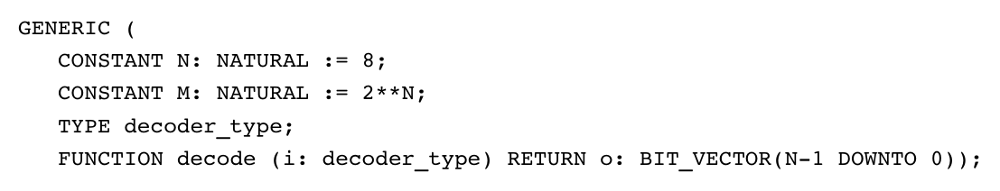

6）通用可以声明的位置也进行了扩展，包括PACKAGE与子程序头。通用PACKAGE与FUNCTION如下所示。

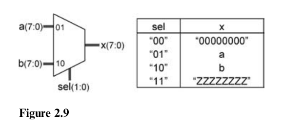

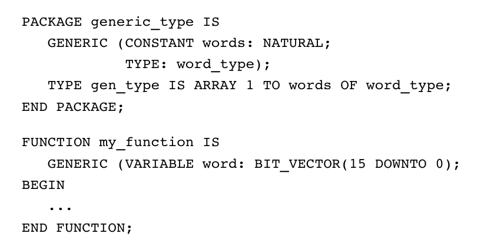

7）带有通用列表的包被称为未实例化的包，必须使用包实例化声明进行实例化，如下面的简化语法所示。上面所述的generic_type包的实例化示例如下所示。

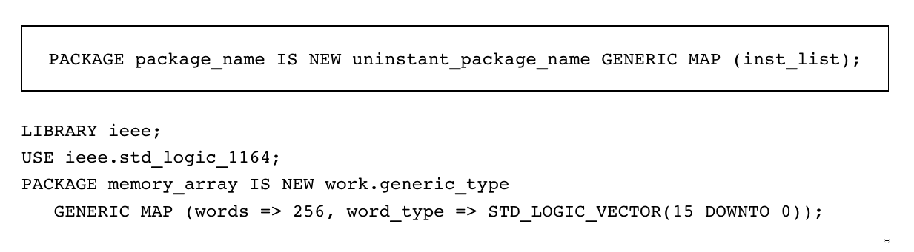

2.10 练习
==================
