2 Code Structure
^^^^^^^^^^^^^^^^^^^

2.1 基础VHDL单元
=====================

本章描述构成VHDL代码的基础部分：库声明，ENTITY与ARCHITECTURE。同时包含一些介绍性设计示例。

正如图2.1中所展示的，一个基础VHDL代码由三部分组成：

* 库/包声明：包含设计中需要的所有库列表与相应的包。最常用的库有ieee，std与work（后两者是默认可见的）。
* ENTITY：主要指定电路的I/O端口，以及（可选的）常用变量。
* ARCHITECTURE：包含VHDL代码，描述电路如何作用，由此可以推导符合标准的硬件。

LIBRARY是常用到的代码片段集合。将其放置在库中可以允许代码代码并与其它设计共享。一个库的典型结构如图2.1b所示。所有之前设计的电路都可以是库的组成部分。然后这样的电路可以使用COMPONENT关键字用于其它设计中。另一种流行的选择是以FUNCTION或PROCEDURE（被称为子程序）的形式编写常用的代码片段，然后将其放置在PACKAGE中，其位于库中。数据类型的通用声明通常也位于库中。

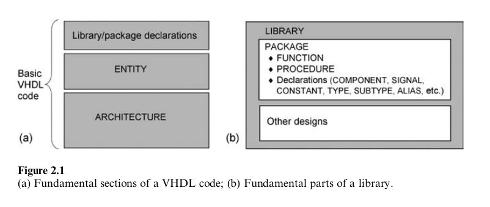

2.2 VHDL库与包
======================

标准VHDL库为std与ieee，而其主要包列于下表。同时列出了常用的非标准包。

std库
:::::::::::::

* standard包（附录H）：此包定义于IEEE1076标准之中，自VHDL第一版开始就是其组成部分。其中包含多个数据类型定义（BIT，INTEGER，BOOLEAN，CHARACTER，等）以及相应的逻辑，算术，比较，移位，与连接操作符。此包在VHDL2008中进行了扩展。
* textio包（附录M）：用于文本与文件的资源包，同样定义于IEEE1076标准之中，同样在VHDL2008中进行了扩展。

ieee库
::::::::::::

* std_logic_1164包（附录I）：定义9值数据类型STD_ULOGIC与STD_LOGIC，相对于原始的BIT类型，其主要特性在于额外的可合成值，不在乎（'-'）与高阻抗（'Z'）（BIT仅允许0和1）的存在。此包定义于IEEE1164标准之中。
* numeric_std包（附录J）：引入了类型SIGNED与UNSIGNED以及相应的操作符，使用STD_LOGIC作为基础类型。此包定义于IEEE1076.3标准之中。
* numeric_bit包：与numeric_std相同，但使用BIT作为基础类型。
* numeric_std_unsigned包（附录N）： 在VHDL2008中引入，此包被期望用于替换非标准包std_logic_unsigned。
* numeric_bit_unsigned包：同样在VHDL2008中引入，此包类似于上面的包，但是操作BIT_VECTOR类型而不是STD_LOGIC_VECTOR。
* env包：在VHDL2008中引入，它包含用于与模拟环境通信的stop与finish过程。
* fixed_pkg包（以及相应的包）：Kodak开发，VHDL2008中引入，它定义了无符号与有符号的定点类型UFIXED与SFIXED以及相关的操作符。
* float_pkg包（以及相应的包）：同样由Kodak开发，并在VHDL2008中引入，它定义了浮点类型FLOAT以及相关的操作符。

非标准包
::::::::::::::

* std_logic_arith包（附录K）：定义了类型SIGNED与UNSIGNED以及相对应的操作符。此包部分等同于numeric_std。
* std_logic_unsigned包：引入了将STD_LOGIC_VECTOR信号类型作为无符号数字进行算术，比较以及其移位操作的函数。
* std_logic_signed包（附录I）：与上面的包相同，但是处理有符号数字。

最后两个包可以看作是对std_logic_1164包的补充，因为后者并不包含对STD_LOGIC_VECTOR类型进行算术或比较操作符，而前两者有。

当处理数据类型与操作符时，所列的包将会分别在第3章与第4章中进行详细探讨。

2.3 库/包声明
=====================

为使包对设计可见，需要两个声明，一个用于包所在的library，另一个是指向特定包的use语句。对应的语法如下所示。

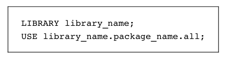

最常用的包有：

* std库中的standard包（默认可见）
* work库（保存工程文件所在的目录，同样默认可见）
* ieee库中std_logic_1164包（当需要时，必需显示式声明）

对应的语法声明如下。

.. code::

    1 ------------------------------------------------
    2 LIBRARY std;            --optional declaration
    3 USE std.standard.all;   --optional declaration
    4 LIBRARY work;           --optional declaration
    5 USE work.all;           --optional declaration
    6 LIBRARY ieee;
    7 USE ieee.std_logic_1164.all;
    8 USE work.my_package.all
    9 ------------------------------------------------

standard包默认可见，因而无需要显示式声明。对于work库同样如此。与之相对，当在工程中使用STD_(U)LOGIC类型时需要声明std_logic_1164包。如果同时需要用户编写的额外包，则也必需要进行声明，如上面的第8行所示。

注意上面声明中的分号标识声明或语句的结束，而双横线表示注释。VHDL代码并不是大小写敏感的。正如所提到的，关于库/包的其它细节将会在下面的两章中详细讨论。

2.4 ENTITY
==============

ENTITY的主要组成部分是PORT，它是电路所有输入与输出端口的规格列表。简化的语法如下所示。

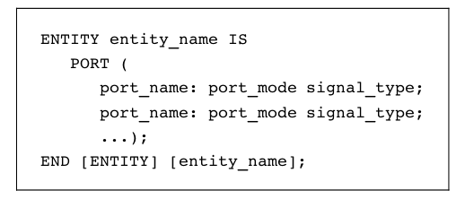

实体名字可以是任意单词，除了VHDL保留字（附录G）。对于端口名字同样如此。

上述语法中PORT域的所有成员均是信号（相对于变量）；也就是，电路的输入与输出线。其模式可以是IN，OUT，INOUT或BUFFER。如图2.2a所示，IN与OUT是真正的单向线路，而INOUT是双向线路，当一个信号被发出同时会被内部所用（读取）时使用BUFFER。最后类型可以是BIT，INTEGER，STD_LOGIC等。

通过创建一个内部的辅助信号，可以避免BUFFER的使用。而且，当使用VHDL 2008实现时，模式OUT可用于内部读取。

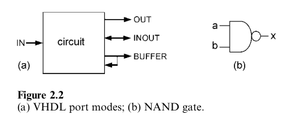

当实现记忆存储时，INOUT的使用特别重要，通常会使用相同的数据总线用于写入与读取。

示例：下面是图2.2b的NAND门的ENTITY，命名为nand_gate。其含义如下：电路有三个I/O端口，其中两个输入（a与b，模式IN），而另一个为输出（x，模式OUT）。所有三个信号的类型为BIT。

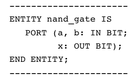

在前面的语法中，只显示了PORT域。然而，正如下面所示，一个实体可以包含三个其它域，GENERIC声明部分（在PORT之前），一个通用描述部分（在PORT之后），以及最后是一个带有被动调用或处理（也在PORT之后）的部分。

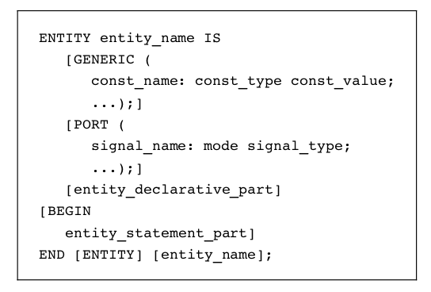

只有实体的PORT部分是必须的。可选的GENERIC部分用于声明为设计，包括端口，全局可见的常量。

可选的描述部分（在PORT之后），尽管很少使用，可以包含下述内容：子程序声明，子程序体，类型声明，子类型声明，常量声明，信号声明，共享变量声明，文件声明，别名声明，属性声明，属性规格，断联规格，使用子句，组合模板声明，以及组合声明。

最后，可选的语句部分，同样很少使用，可以包含被动调用与/或被动处理（也就是，并不涉及任何信号赋值的部分。例如，它们可以用于测试PORT值）。GENERIC域会被经常用到，而另两个可选部分很少使用。

示例：下面的ENTITY包含上面提及的四部分中的前三个。

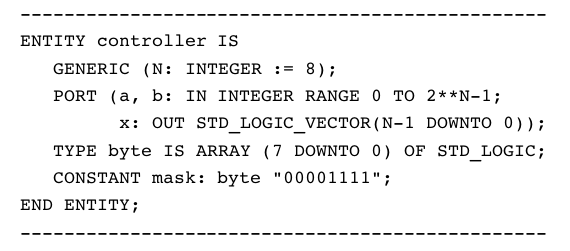

在VHDL 2008中，实体的描述部分也可以包含下列内容：子程序实例化声明，包声明，包体，包实例化声明，以及PSL声明。参看2.9节了解其它特性。

2.5 ARCHITECTURE
====================

ARCHITECTURE包含电路如何作用的描述，由此可以推导实际的电路。简化的语法如下所示：

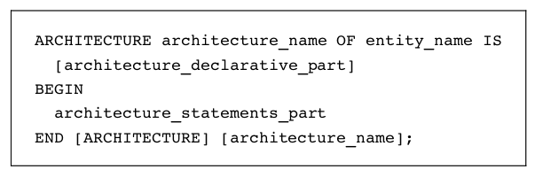

可见，实体包含两部分：描述（可选）部分，以及语句（代码）部分。前者包含也实体描述部分相同的内容，以及组件声明与配置规格（在VHDL 2002或VHDL 2008中）。后者是VHDL语句所在的位置。与实体类似，结构名可以是任意的单词，包括与实体名相同的名字。

示例：如下是图2.2b中NAND门的ARCHITECTURE，以arch命名。其含义如下：电路必须执行a与b之间的NAND操作，将结果赋值给x。在此示例中，在描述部分并没有声明，而代码仅包含一条逻辑语句。

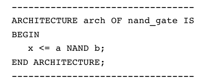

2.6 GENERIC
==================

GENERIC声明允许通用参数的规格（也就是，通用参数可以很容易为不同的应用而修改）。其目的是参数化设计，使得代码更为灵活与可重用。

正如2.4中ENTITY的语法所示，GENERIC是PORT子句前允许的唯一声明，从而使得这些常量为全局可见，因为它们甚至可以用于PORT规格之中。GENERIC声明的简化语法如下所示。

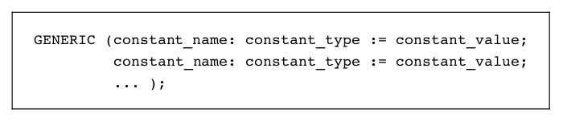

示例：下面实体中的GENERIC声明指定了两个参数，名为m与n。第一个为INTEGER类型，值为8,而第二个为BIT_VECTOR类型，值为"0101"。因而，当代码中遇到m与n时，值8与"0101"会自动赋值给它们。

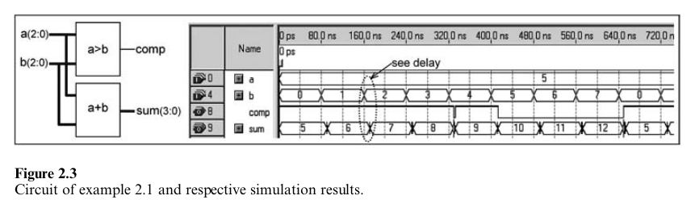

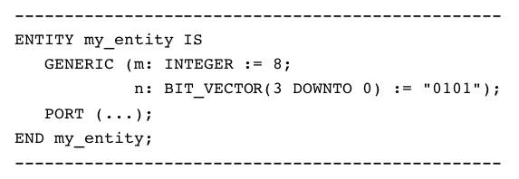

GENERIC MAP：如果包含一个GENERIC声明的COMPONENT（类似上面的代码）在其它设计中被实例化，出现在被实例化的组件中的通用常量值可以为主设计所覆盖。这是通过GENERIC MAP声明实现的，我们会在第8章研究组件实例化时遇到此声明。GENERIC使用的示例演示会在下一节（示例2.4）中展示。

在VHDL 2008中，除了传统的通用常量，通用类型与通用子程序也被支持。通用常量可用于相同通用列表的其它通用常量的声明中。通用声明所在的位置也进行了扩展，除了ENTITY与BLOCK头部以外，也可以在PACKAGE（第8章）与子程序头部（第9章）中声明。

2.7 初步VHDL示例
========================

在本节中，我们会展示一些VHDL代码的入门级示例。尽管我们还没有探讨示例中出现的结构，他们有助于展示基础内容，而忽略整体代码结构。每个示例通过解释性注释与仿真结构来实现。

示例2.1：Compare-Add电路
::::::::::::::::::::::::::::::

在图2.3的左侧，展示了一个两时钟电路。输入是两个无符号的3位值（a与b，范围由0至7），而输出为comp（单一位）与sum（为避免溢出，需要4位，所以范围为0至15）。上半部分比较a与b，当a>b时生成'1'，否则生成'0'。下半部分将a与b相加，生成sum。

此电路的VHDL代码如下所示。注意短横线的使用（1,4,10,16行）可以更好地组织代码（将其分为三个基础部分）。库声明出现在第2-3行。名为comp_add的实体出现在第5-9行。最后名为circuit的结构出现在第11-15行。

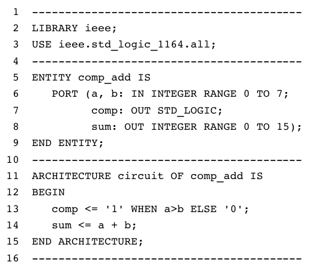

注意， 此实体包含所有I/O端口。输入为a与b（模式IN，第6行），两者类型为INTEGER，范围为0至7（3位无符号值）。输出为comp（第7行）与sum（第8行），前者为STD_LOGIC（单个位）类型，后者为INTEGER类型，范围为0至15（4位无符号值）。

结构仅包含两条语句，第一条语句（13行）进行比较（通过WHEN语句），而第二条语句（14行）计算和（通过+操作符）。在此示例中，在结构的描述部分并没有任何声明。

仿真结果如图2.3所示。注意，所有的输入信号以带有"I"的箭头为前缀，而每个输出信号显示为带有"O"的箭头。固定值（5）被赋值给a，而b在整个3位范围（0至7）上变化。当a>b时，结果为comp='1'，而sum=a+b（无溢出）。可以看到这是一个时间仿真，因为考虑到了内部传播时延。

注意，当b由3变化到4时，在comp上出现脉冲干扰。这是因为在此变化时，b的所有位发生变化（"011"->"100"），因而所有位并不会在精确的时刻同时发生变化，而且实际上的晶体管并不是即时的，因而这种扰动是十分常见的。

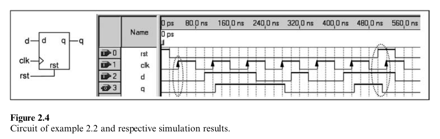

示例2.2：D-type Flip-Flop(DFF)
::::::::::::::::::::::::::::::::::::::

图2.4展示了一个DFF，这是最基础的存储电路之一。它的输入为d（data），clk（clock）与rst（reset），而q（存储的数据）是其输出。在此情况下，DFF在正时钟变换（向上）时触发，但相反的触发时刻也是可能的。当clk由0变换到1的时刻，输出拷贝输入(q<=d)，直到出现新的向上的时钟边界。重置是异步的（也就是它并不依赖于clk），因而如果发生rst='1'时，输出立即被清零。

有多种实现DFF的方式，其中一种就是下面所展示的方案。然而，必须记住的是，VHDL代码本质上是并行的（相对于序列化的常规计算机程序），因而要实现任意的时钟电路，我们必须强制VHDL变为序列化，这也可以通过PROCESS来实现，如下所示。

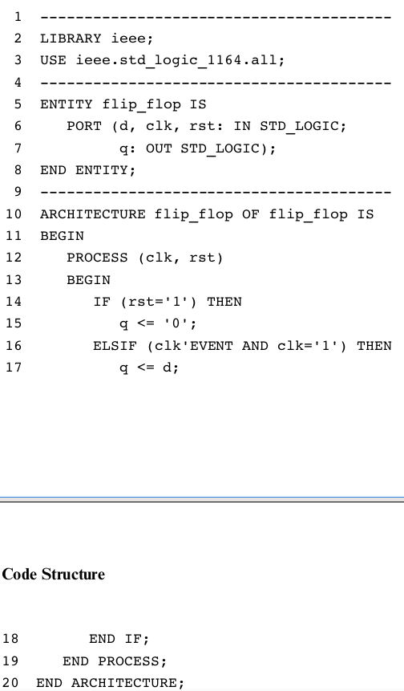

关于代码的解释如下。

第2-3行：代码的第一部分（库声明）。回忆一下，此声明类型由库名字后跟库use子句组成。因为在此设计中使用了数据类型STD_LOGIC，因而必须包含包std_logic_1164。另外两个库（std与work）默认可见。
第5-8行：代码的第二部分（ENTITY），在此示例中名为flip-flop。
第10-20行：代码的第三部分（ARCHITECTURE），此处与实体同名。
第6行：输入端口，所有输入端口为STD_LOGIC类型。
第7行：输出端口，所有输出端口为STD_LOGIC类型。
第12-19行：结构的代码部分（
