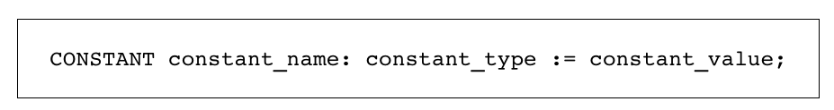
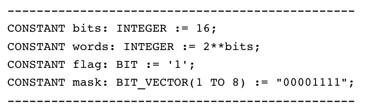
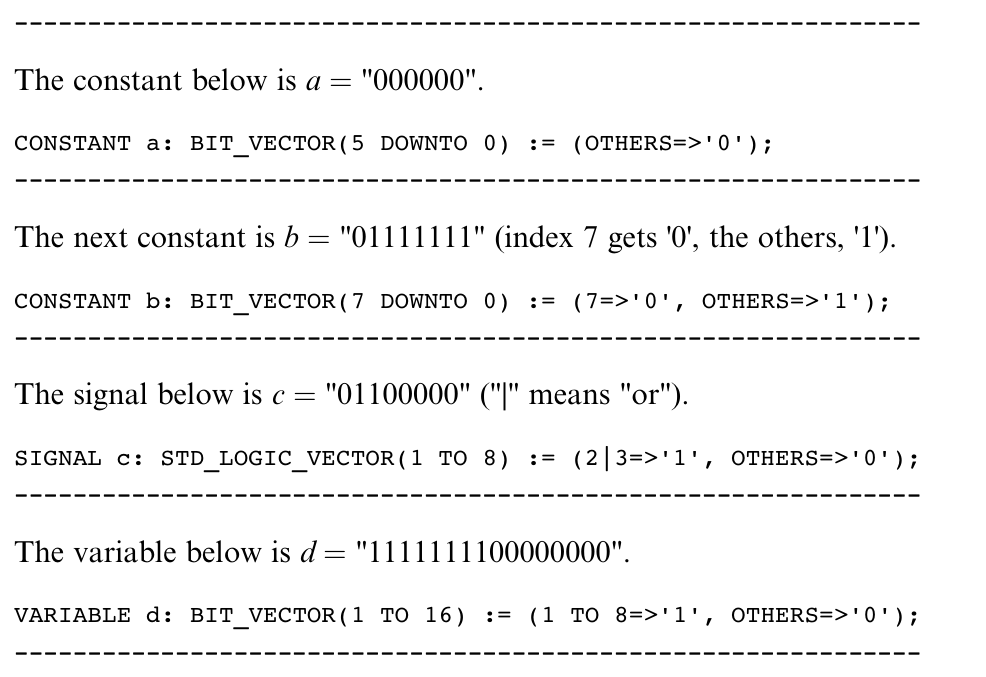
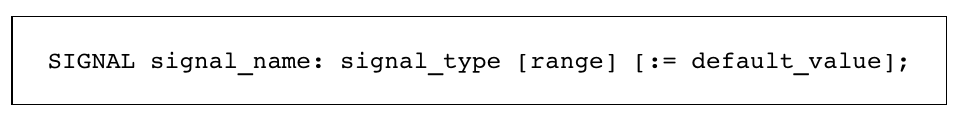
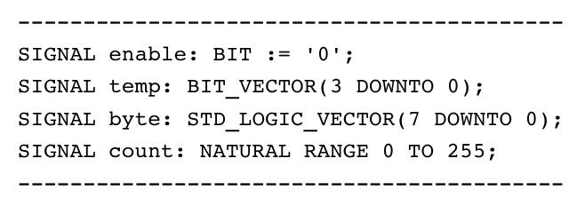
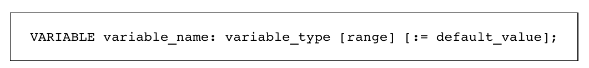
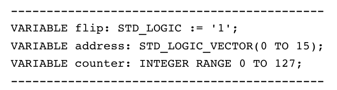
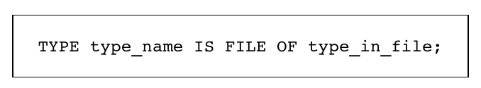
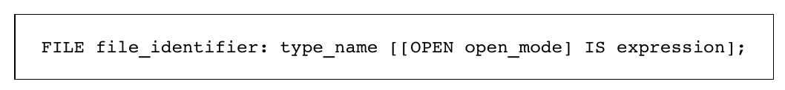
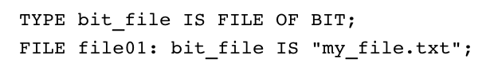

3 Data Types
^^^^^^^^^^^^^^^^^^

3.1 简介
=============

为有效编写VHDL代码，了解哪些数据类型是被允许的，以及如何指定与使用这些数据类型，是必不可少的。

VHDL数据类型可以分为两类：预定义数据类型与用户定义数据类型。前者是标准化的，并由VHDL编译器附带的库提供，而后者由用户创建来处理特殊情况。

本章会详细描述两种数据类型。可合成的数据类型会被特别强调。同时也会包含数据兼容性与类型转换的讨论。

3.2 VHDL对象
=================

在我们开始描述VHDL数据类型之前，让我们简要描述VHDL对象，因为这是类型规范所要要求的。

对象是具有值的特殊类型的命名项。换句话说，对象是由可传递值的方法来构成的。这样的VHDL对象有CONSTANT，SIGNAL，VARIABLE与FILE。例如，所有的GENERIC与PORT项是对象，因为前者是常量，而后者是信号。

SIGNAL与VARIABLE要比CONSTANT更为复杂，所以需要特别注意。对他们的研究主要由三部分构成，如下：

* Section 3.2：关注对象声明的概念，语法与示例（需要在本章后续部分对数据类型进行讨论）。
* Section 6.1：其主要属性的总结（需要解释顺序代码，这正是该章节的目标）。
* 第7章：SIGNAL与VARIABLE比较，并详细讨论主要属性，用法与flip-flop推理。

FILE对象与会以本章进行描述，但仅是概要描述。因为文件对于仿真特别重要，因而会在第10章中进行详细讨论。

CONSTANT
::::::::::::::::::::::::

正如其名字所表明的，它是值不可以被修改的对象。常量声明的简化语法如下所示。

name可以是除保留字外的任意单词。type可以是任意VHDL数据类型，预定义或用用户自定义类型。最后，value可以是常量或是涉及常量的表达式。

示例  下面第一个常量的名字是bits，其类型为INTEGER，而其值为16。第二个常量名为words，其类型也为INTEGER，其值为2^16=65536。第三个常量名为flag，其类型为BIT，而其值为'1'（单个位必须使用单引号包围）。最后，第四个常量名为mask，其类型为BIT_VECTOR，共有8位，以升序索引，由1至8，其值为"00001111"（对多位使用双引号）。

CONSTANT可以在ENTITY，ARCHITECTURE，PACKAGE，PACKAGE BODY，BLOCK，GENERIC，PROCESS，FUNCTION与PROCEDURE（最后两个被称为子程序）的声明部分中声明。当在包中声明时，例如，它是全局的，因为包可以为任意的设计文件所使用。当在实体中声明时（位于PORT之后），它仅对实体之后的结构是全局的。当在结构中声明时（在其声明部分），它仅对特定的结构是全局的。

解引用常量
::::::::::::::::::::

声明为不带值的常量被称为解引用常量。这样的声明允许出现在PACKAGE中，但是完整的规范（包括值）必须出现在对应的PACKAGE BODY中（第8章会研究包）。

关键字OTHERS
::::::::::::::::::::::::::

OTHERS是用于赋值的一个有用的关键字。它表示未指定的所有索引值。

示例
::::::::::::

SIGNAL
:::::::::::::::

SIGNAL用于在电路内外以及内部单元之间传递数据。换句话说，信号表示电路连线。实体的所有端口默认为信号。

信号声明可以在ENTITY，ARCHITECTURE，PACKAGE，BLOCK与GENERATE的声明部分完成。在顺序代码中不允许信号声明（例如，PROCESS与子程序），但是可以使用信号。信号声明的简化语法如下所示。

示例  下面的第一个信号为enable，其类型为BIT，而其默认（初始）值为'0'。第二个信号名为temp，其类型为BIT_VECTOR，总共为4位，以逆序索引。第三个信号为byte，其类型为STD_LOGIC_VECTOR，总共为8位，同样以逆序索引。最后，第四个信号名为count，其类型为NATURAL，范围为0至255。对最后三个信号并没有指定默认值。

当在顺序代码（PROCESS或子程序）中使用SIGNAL时，很重要的一点是，信号并不是立即更新的。相反，仅在当前PROCESS或子程序运行之后才会准备好新值。

另外需要关注的重要点在于对一个信号的多次赋值。在并行代码中，编译器会发出错误信息并退出编译。在顺序代码中，仅会考虑最后一次赋值。总之，不要进行多次信号赋值。

要为SIGNAL赋值，正确的操作符是"<="，而对于CONSTANT或VARIABLE（或默认值）则为":="。例如，"enable<='1';"。正如所示，关键字OTHERS也可以进行信号赋值。

VARIABLE
::::::::::::

相对于CONSTANT与SIGNAL，VARIABLE仅表示局部信息，因为仅可以在其创建所在的顺序单元（例如，PROCESS或子程序）中可见与修改。另一方面，其更新是即时的，从而新值可以在代码的下一行中所用的。同时，由于更新是即时的，可以对相同变量进行多次赋值。变量声明的简化语法如下所示。

示例  下面的第一个变量名为flip，其类型为STD_LOGIC，而其默认（初始）值为'1'。第二个变量名为address，其类型为STD_LOGIC_VECTOR，总共为16位，以升序索引，由0至15。最后，第三个变量名为counter，其类型为INTEGER，范围由0至127。对最后两个变量并没有指定默认值。

要为VARIABLE赋值，正确的操作符是":="。例如，"flip:='0';"。关键字OTHERS也可以进行变量赋值。

FILE
::::::::::::

第四个与最后一个VHDL对象是FILE。然而，要声明一个该类型的对象，必须首先创建一个FILE类型。

FILE type
:::::::::::::

文件类型的简化语法如下所示。它包含选定来表示类型与文件中所包含的数据类型的名字（仅允许一个类型），后者可以是任意VHDL类型，预定义类型或用户自定义类型。

FILE object
::::::::::::::::::

文件对象声明的简化语法如下所示。它包含一个选定用来表示对象的标识符（名字），后跟类型名，然后是可选的关键字OPEN，带有对应的文件打开模式（read_mode，write_mode或append_mode，在std库的standard包中定义）。语法最后的可选expression可以是文件名（位于双引号中）。

示例  文件对象后跟的文件类型声明如下。

正如所提到的，关于文件使用的详细内容可以参看第10章。

SIGNAL与VARIABLE
::::::::::::::::::::::

第7章将会提供SIGNAL与VARIABLE之间区别及其使用的详细讨论。

3.3 数据类型库与包
==========================

正如在第2.2节中所提到的，VHDL包含了一系列的预定义数据类型，在不同的包中进行指定。处理二值逻辑与数值的基础包为：

* standard包（在VHDL 2008中进行了扩展）
* std_logic_1164包（在VHDL 2008中进行了扩展）
* numeric_bit包（在VHDL 2008中进行了扩展）
* numeric_std包（在VHDL 2008中进行了扩展）
* std_logic_arith包（共享软件，非标准包）
* std_logic_unsigned包（共享软件，非标准包）
* std_logic_signed（共享软件，非标准包）
* textio包（在VHDL 2008中进行了扩展）
* numeric_bit_unsigned包（在VHDL 2008中引入）
* numeric_std_unsigned包（在VHDL 2008中引入）

在VHDL 2008中同时引入了多个新包用于处理定点与浮点数值。主要有：

* fixed_pkg包
* fixed_generic_pkg包
* float_pkg包
* float_generic_pkg包
* fixed_float_types包

上述所列的每个包将会在下面进行简要介绍。

standard包（参看附录H）
:::::::::::::::::::::::::::::::::::

